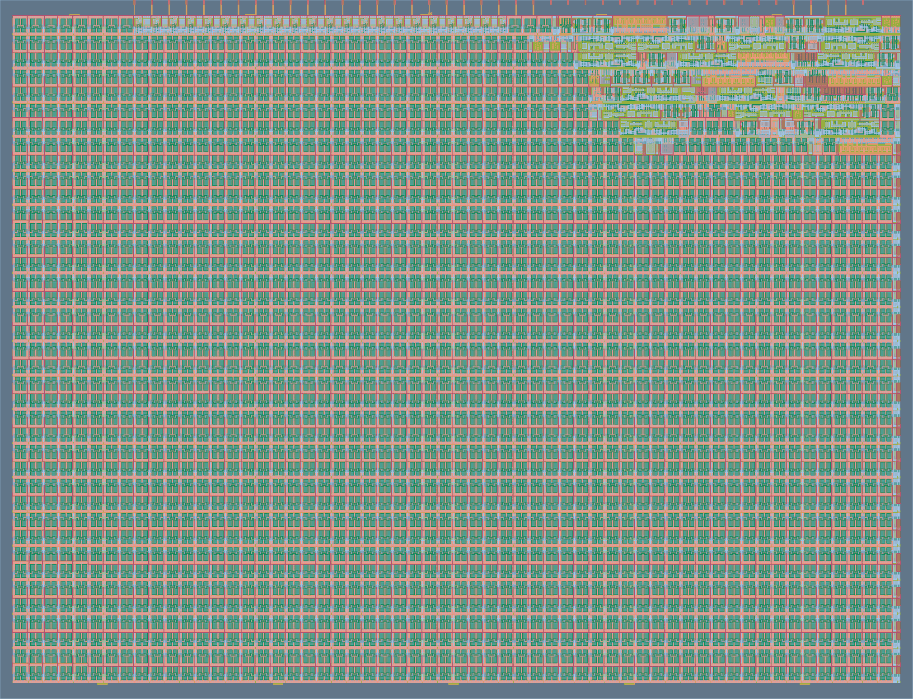

## CRC-8 Serial LFSR

[](https://github.com/mena-emil/tt-crc8-lfsr/actions/workflows/gds.yaml)
[](https://github.com/mena-emil/tt-crc8-lfsr/actions/workflows/docs.yaml)
[](https://github.com/mena-emil/tt-crc8-lfsr/actions/workflows/test.yaml)

An 8-bit **Linear Feedback Shift Register (LFSR)** that computes a serial
**CRC-8**, designed in Verilog and fabricated as a [Tiny Tapeout](https://tinytapeout.com) chip.

**[Explore the chip in 3D](https://gds-viewer.tinytapeout.com/?model=https://mena-emil.github.io/tt-crc8-lfsr/tinytapeout.oas&pdk=ihp-sg13g2)** · **[GDS layer explorer](https://gds-explorer.tinytapeout.com/viewer?file=https://mena-emil.github.io/tt-crc8-lfsr/tinytapeout.oas&pdk=ihp-sg13g2)**

## How it works

The core is a classic Galois-style LFSR built from 8 registers (`R7..R0`)
with two internal XOR feedback taps — one between `R7`/`R6`, one between
`R3`/`R2`. The register is seeded to `8'hD8` on reset. The feedback signal
is:

```
Feedback = DATA_in XOR R0
```

```
DATA ──⊕───▶ R7 ──▶ R6 ──⊕───▶ R5 ──▶ R4 ──▶ R3 ──⊕───▶ R2 ──▶ R1 ──▶ R0 ──┬──▶ CRC (out)
       │                  │                         │                     │
       └──────────────────┴─────────────────────────┴─────────────────────┘
                                    feedback (XOR)
```

**Loading a byte (ACTIVE high):** one bit of DATA is shifted in per clock,
LSB first, XORed into the feedback path at the two tap points and at the
register's input. After 8 clocks, the register holds the 8-bit CRC
remainder for that byte.

**Reading out the CRC (ACTIVE low):** the register shifts itself out
serially for 8 clocks — `R0` first — while `Valid` stays high to mark the
output as meaningful, then drops low again once all 8 bits are out.

## Verified: 10/10 test vectors passed

The RTL was checked against 10 known-good data/CRC byte pairs, driven
through the actual chip datapath (`ui_in`/`uo_out`) via the Cocotb
testbench in `test/test.py`:

```
Test case 0: PASSED (data=0x93, CRC=0x78)
Test case 1: PASSED (data=0x72, CRC=0x44)
Test case 2: PASSED (data=0x36, CRC=0x11)
Test case 3: PASSED (data=0x1B, CRC=0xD2)
Test case 4: PASSED (data=0xA6, CRC=0x09)
Test case 5: PASSED (data=0xC0, CRC=0xB2)
Test case 6: PASSED (data=0x55, CRC=0x36)
Test case 7: PASSED (data=0xF2, CRC=0x80)
Test case 8: PASSED (data=0x5E, CRC=0x2C)
Test case 9: PASSED (data=0x11, CRC=0x63)
========================================
10-VECTOR CRC-8 TEST: PASSED=10 FAILED=0
```

## Architecture

| Signal   | Width | Purpose                                            |
| -------- | ----- | --------------------------------------------------- |
| DATA     | 1-bit | Serial data input, LSB first                         |
| ACTIVE   | 1-bit | High while a data byte is being shifted in            |
| LFSR     | 8-bit | Shift register, seeded to `8'hD8` on reset            |
| CRC      | 1-bit | Serial CRC output, R0 first                           |
| Valid    | 1-bit | High for exactly 8 clocks while CRC bits shift out     |

## Repository structure

```
src/tt_um_crc8_lfsr.v   Tiny Tapeout top module: tt_um_crc8_lfsr
src/CRC.v                CRC/LFSR core (registers, feedback taps, output counter)

test/tb.v                Cocotb wrapper
test/test.py              Cocotb test, replays the 10 reference test vectors
test/DATA_h.txt           Test data bytes (10 cases)
test/Expec_Out_h.txt      Expected CRC bytes (10 cases)
test/Makefile             Runs the simulation with Icarus Verilog + cocotb

images/gds_layout.png     Chip layout render (from the gds workflow)

docs/info.md              Project documentation (Tiny Tapeout docs page)
info.yaml                  Tiny Tapeout project/pinout metadata
```

## Pins

```
ui_in[0]     DATA   - serial data in, LSB first
ui_in[1]     ACTIVE - high while DATA is being shifted in
ui_in[7:2]   unused

uo_out[0]    CRC    - serial CRC bit out, R0 first
uo_out[1]    Valid  - high while CRC bits are being shifted out
uo_out[7:2]  unused, driven low

uio[7:0]     unused (all configured as inputs)

clk          10 MHz intended operating frequency
rst_n        active-low async reset
```

## How to test

The automated Cocotb test is in `test/test.py`:

```
cd test
python -m pip install -r requirements.txt
make
```

The test resets the design, shifts each of the 10 reference data bytes in
LSB-first while ACTIVE is held high, waits for Valid, and checks the 8 CRC
bits shifted out against the expected value. All 10 cases should report
`PASSED`.

## External hardware

None. This project only uses the Tiny Tapeout dedicated I/O pins — no
PMOD, display, or other external hardware is required, in simulation or
on the fabricated chip.

## Layout / GDS

The design has been hardened and routed for the IHP SG13G2 open-source
PDK. GDS, gate-level test, and all Tiny Tapeout prechecks passed:

| Precheck                              | Result |
| -------------------------------------- | ------ |
| KLayout pin label overlapping drawing  | ✅     |
| KLayout SG13G2 DRC                     | ✅     |
| KLayout zero area                      | ✅     |
| KLayout checks                         | ✅     |
| Pin check                              | ✅     |
| Boundary check                         | ✅     |
| Layer check                            | ✅     |
| Cell name check                        | ✅     |
| Analog pin check                       | ✅     |
| Verilog syntax check                   | ✅     |

| Metric      | Value |
| ----------- | ----- |
| Tile size   | 1x1   |



*Rendered from the fabricated `tt_um_crc8_lfsr` macro — the dense logic
block in the upper right is the LFSR/CRC core; the rest of the tile is
standard filler/decap cells required to meet density rules.*

Explore the layout interactively:

- **3D viewer:** `https://gds-viewer.tinytapeout.com/?model=https://mena-emil.github.io/tt-crc8-lfsr/tinytapeout.oas&pdk=ihp-sg13g2`
- **GDS explorer (2D, layer-by-layer):** `https://gds-explorer.tinytapeout.com/viewer?file=https://mena-emil.github.io/tt-crc8-lfsr/tinytapeout.oas&pdk=ihp-sg13g2`

## Project info

|                |                     |
| -------------- | ------------------- |
| **Title**      | CRC-8 Serial LFSR    |
| **Language**   | Verilog              |
| **Clock**      | 10 MHz               |
| **Tiles**      | 1x1                  |
| **Top module** | `tt_um_crc8_lfsr`    |

**Author:** Mena Emil

See [`docs/info.md`](docs/info.md) for the full write-up.
